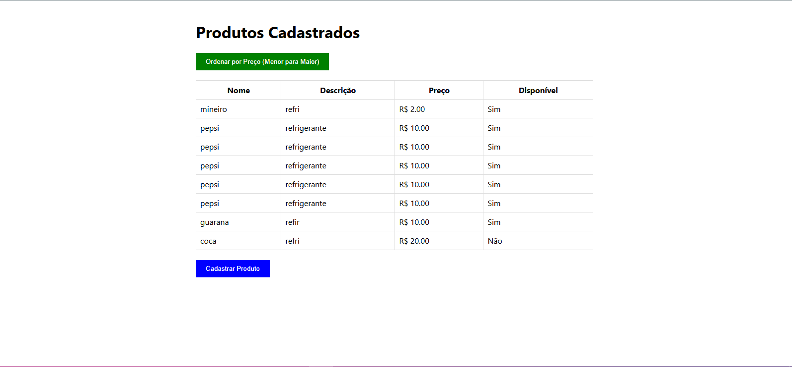
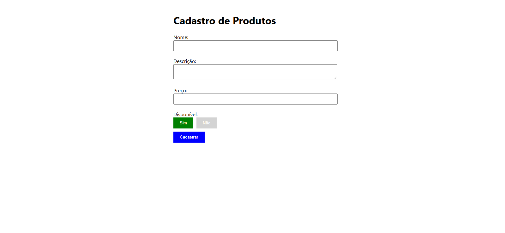

# Projeto Estágio OAK 

## Este projeto foi desenvolvido para concorrer a vaga de estágio da empresa OAK Tecnologia

## Introdução

O Projeto consiste em fazer um CRUD simples de produtos em qualquer linguagem de programação. Como desejado, o projeto deve ter os campos exigidos e as funcionalidades de cadastro, listagem e ordenação dos produtos. 

Acesse o projeto em: https://github.com/JotahIvo/DesafioOAK

## Front end

Foi escolhido o framework React para o desenvolvimento do front end, pela sua facilidade de adicionar componentes na construção de uma interface e diversas funcionalidades que permitem um projeto mais simples e dinâmico.

Foram feitas duas telas para o projeto, a tela inicial onde temos a listagem de todos os produtos cadastrados, um botão que faz o filtro de menor para o maior preço e um botão que permite cadastrar novos produtos. Esse botão nos leva a uma outra tela que nos permite esse cadastro. Como vemos nas imagens abaixo:


Imagem 1: Página de listagem de produtos


Imagem 2: Página de cadastro de produtos

## Backend

No backend optei por utilizar Django e Django Rest para fazer a API de CRUD, pois já tenho conhecimento e realizei alguns projetos utilizando esse framework. Além disso, foi utilizado um banco de dados SQLite para armazenar os dados.

## Como rodar o projeto

### Requisitos
Para rodarmos o projeto devemos ter o Node instalado em sua última versão e alguns pacotes e bibliotecas do Python, acompanhe o tutorial:

### 1° Clonar o repositório:

```bash
$ git clone git@github.com:JotahIvo/DesafioOAK.git
```

### 2° Criar a venv e instalar as dependências:
```bash
$ cd backend
$ python3 -m venv venv
$ source venv/bin/activate
$ pip install -r requirements.txt
```

### 3° Rodar o backend:
```bash
$ python3 manage.py runserver
```

Agora o backend da aplicação já está rodando em seu computador na porta https://127.0.0.1:8000/


### 4° Rodar o frontend:
```bash
$ cd ../frontend/product-registration
$ npm start
```

Pronto, assim que rodar, seu navegador vai abrir diretamente na tela inicial e você já pode começar a usar a aplicação!

Criado por João Pedro de Almeida Ivo.
